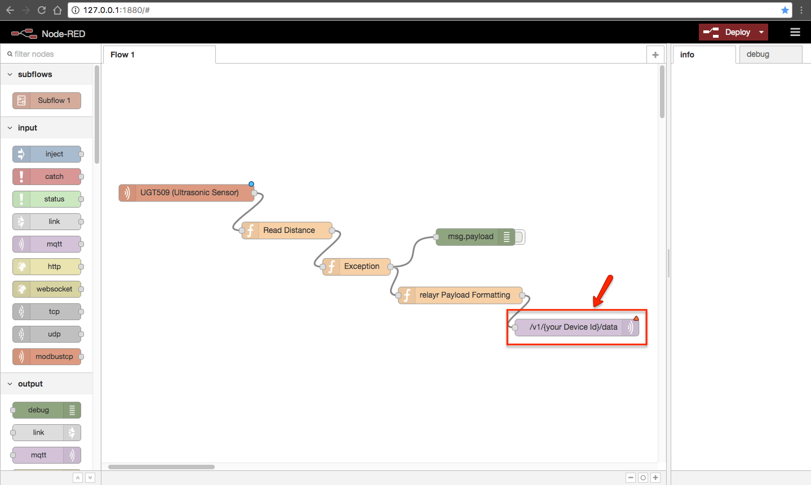

# IO-Link Sensors and the Industrial IoT Starter Kit

## Introduction

**[IO-Link](http://www.io-link.com/en/Technology/what_is_IO-Link.php)** is an industrial communication standard for connecting intelligent sensors and actuators. Due to its simplicity and ease of use, it's the perfect choice for quickly implementing an industrial IoT setup.

This tutorial will help you connect the IO-Link Master and sensors included in the **Industrial IoT Starter Kit**, pull data via Modbus and publish it to the relayr Cloud via MQTT. In order to collect the data from the fieldbus and send it to the cloud, ideally we will use a Vertex-enabled gateway (for advanced users), or at least a computer capable of running a Modbus software adapter, i.e. a set of libraries (for beginners).

**NOTE:** If you are using a gateway, the required relayr Vertex distribution must include the built-in Modbus adapter.

## Requirements

The following hardware is required:

* [AY1020](http://www.ifm.com/products/gb/ds/AY1020.htm) (IO-Link Master)
* [KQ5100](http://www.ifm.com/products/gb/ds/KQ5100.htm) (Capacitive Sensor)
* [UGT509](http://www.ifm.com/products/gb/ds/UGT509.htm) (Ultrasonic Sensor)
* [TA2105](http://www.ifm.com/products/gb/ds/TA2105.htm) (Temperature Sensor)
* 2x [EVC001](http://www.ifm.com/products/gb/ds/EVC001.htm) (Cables with M12 Connector)
* 24V Power Supply (this setup has been implemented using a [Siemens SITOP PSU100S 6EP1334-2BA20](https://mall.industry.siemens.com/mall/en/ww/Catalog/Product/6EP1334-2BA20))
* Power Cord
* Assorted Wires for 24V Supply
* Cable Cutter and Small Screwdriver

A computer is required to access the web server configuration menu of the IO-Link Master and (if no gateway is available) also to publish the Modbus data of the sensors to the relayr Cloud.

## Installation & Configuration

### Setting Up the Hardware

**IMPORTANT:** Only qualified personnel are allowed to install the device/system and set it into operation.

Before getting started, we will have to provide power to the IO-Link Master. Most regulated 24V power supplies come without a power cord, so we will have to attach such a cable first. The picture below shows how to connect an ungrounded power cord to the input wire clamps (AC 120/230V, 50/60Hz), according to the following setup:

```
POWER CORD   |   POWER SUPPLY
     Brown ----- N (Neutral)
      Blue ----- L1 (Line)
```

The other end of the power cord **MUST BE DISCONNECTED** from the mains outlet!


For safety reasons, **DO NOT CONNECT** the power supply to the mains outlet yet.

Now, in order to provide power to the IO-Link Master, we will wire this to the 24V DC output of the power supply. In this case, a red wire was used to connect the positive clamps, and a black wire for the negative ones. 

```
 POWER SUPPLY   |   IO-LINK MASTER
V+ or OUTPUT+ ----- V+ (Red Wire)
V- or OUTPUT- ----- V- (Black Wire)
```

On the side of the regulated power supply, it should look like this:


And on the side of the IO-Link Master, like this:


**NOTE:** For advanced settings and more detailed descriptions, please refer to the [AY1020 IO-Link Master user's manual](https://www.ifm.com/download/files/AY1020_Manual_UK/$file/AY1020_Manual_UK.pdf).

The **UGT509 (ultrasonic sensor)** will be connected to the IO-Link Master using an **EVC001 cable**, which is included in the kit. First, connect the ultrasonic sensor to the aforementioned cable, and gently secure the nut.
 
In this guide, the ultrasonic sensor will be connected to Port 7 of the IO-Link Master, though another port can be used if necessary. The EVC001 cable has 4x wires, each one connected to one of the pins of the sensor: Brown (1), white (2), blue (3) and black (4). These wires have to be connected to the IO-Link Master, as shown below:

```
    SENSOR   |   PORT 7
     Brown ----- Pin 1
      Blue ----- Pin 2
     White ----- NC (Not Connected)
     Black ----- Pin 4
```

Now, let's do the same with the **TA2105 (temperature sensor)**. This part will be wired to the IO-Link Master using a **cable of the same type, an EVC001**. Attach the cable to the sensor to proceed.

We'll be connecting this sensor to Port 3 of the IO-Link Master. As with the ultrasonic sensor, the choice of port is up to you. The wires of the EVC001 cable must be connected to the IO-Link Master as follows:

```
    SENSOR   |   PORT 3
     Brown ----- Pin 1
      Blue ----- Pin 2
     White ----- NC (Not Connected)
     Black ----- Pin 4
```

The last sensor on the list is the **KQ5100 (capacitive sensor)**. It comes with its own cable already, and there's no need to attach an additional cable.

This sensor will be connected to Port 4 of the IO-Link Master (again, it can be hooked to a different port if required). The wires of this sensor follow the the same color code as the EVC001 cable, so the pin allocation is easy to guess:

```
    SENSOR   |   PORT 4
     Brown ----- Pin 1
      Blue ----- Pin 2
     White ----- NC (Not Connected)
     Black ----- Pin 4
```

At this point, **after carefully verifying all connections** and wires one more time, you may power the entire setup by connecting the power supply to the mains outlet.

### Connecting and Configuring the IO-Link Master

The next step is to configure the IO-Link Master in order to run the configuration tool, verify that the sensors are working properly, and start reading data via Modbus so that it can be published to the relayr Cloud.

First, connect the AY1020 to your computer (or to the local network) using an Ethernet cable. If you have no local network setup and you plan to use only your computer, you may connect it directly. If your computer doesn't have an Ethernet port, you can use an [Ethernet-to-USB adapter](https://amzn.com/B00ET4KIFK), as shown below:


After connecting the Ethernet-to-USB adapter, make sure that your computer has a **different IP address** than the default address of the IO-Link Master (i.e. `192.168.1.250`). For the sake of simplicity, an IP address with the same network prefix was assigned to the computer when this tutorial was written - in this case, `192.168.1.249`.

If the IO-Link Master is connected to a local network rather than directly to your computer using an adapter, make sure that the default IP address of the device is not in use by another device. If so, the IP address of the IO-Link Master must be changed. The procedure is simple, and it's covered in the next step.

For now, let's connect the other end of the Ethernet cable to one of the ports of the AY1020.


After a few seconds, open a browser and enter the default IP address of the IO-Link Master in the address bar: `http://192.168.1.250/`

If the web interface does not load, verify that your computer is in the same network segment. You may also try with a different browser or try turning the WiFi off temporarily to make sure that it's trying to connect to an internal IP address (i.e. locally).

If everything went well, the web interface will load, and you will be redirected to a general overview with basic system information called "Home."

If the IO-Link Master must have a different IP address (because it will be connected to another network later on), this can be modified in `Configuration` → `Network` → `Edit`, as pictured below:


### Setting Up the Software

**NOTE:** If you are using a gateway running a Vertex distribution with a built-in Modbus adapter instead of a computer, please refer to the [Vertex documentation](http://docs.relayr.io/iot-starter-kits/dsk/vertex).

Once the IO-Link Master is up and running, we will configure the software adapter to read data via Modbus and push it to the relayr Cloud. In this case, we will use the open source tool Node-RED, and an additional library for the Modbus TCP communication.

#### Node-RED

[Node-RED](http://nodered.org/) is a visual data flow tool for wiring nodes in the Internet of Things. These nodes can be **virtual** and/or **physical**. Custom logic can be applied to any data flow. e.g., the data sent by the IO-Link sensors via the master.

Node-RED requires Node.js, so first we will have to install it. You may find several guides to do so, but it is recommended to follow [the one available on the Node-RED website](http://nodered.org/docs/getting-started/installation).

If you are already familiar with Node.js, then you can skip this step and proceed with the installation of Node-RED. The easiest way to install Node-RED is to use node’s package manager, **npm**. Installing it as a global module adds the command `node-red` to your system path. Simply open the terminal and run the following command:

```shell
sudo npm install -g --unsafe-perm node-red
```

#### Modbus TCP Library

To read data from the IO-Link Master via Modbus, we will require an additional library called [Modbus TCP](https://www.npmjs.com/package/node-red-contrib-modbustcp). This library enhances Node-RED so that we can add nodes for communicating with a Modbus TCP server.

To install it, first navigate to the default root directory of Node-RED with the following command:

```shell
cd .node-red
```
**NOTE:** This is only valid if Node-RED was installed in the default directory. Otherwise, you will have to navigate to the directory where the installation was performed.

Once there, run the command:

```shell
npm install node-red-contrib-modbustcp
```

After that, you can make sure that the package was succesfully installed by running:

```shell
npm list
```

The package and its dependencies should be listed then.

## Create a Device in the Developer Dashboard

Before reading sensor data via Modbus, we will have to create a device in the relayr platform. **A device is a representation of our IO-Link Master in the relayr Cloud**. Through this entity, we will manage sent/received data, MQTT credentials through the interface of the [Developer Dashboard](https://dev.relayr.io).

To create a device on relayr Dashboard, follow the [**Devices Guide**](http://docs.relayr.io/getting-started/devices-guide/) and select the **AY1020 IO-Link Master (Industrial IoT Starter Kit)** as a *Device Model*. The best way to find this model when creating the device is to select the tab "By the community," and type the name of the model in the search bar: "AY1020 IO-Link Master (Industrial IoT Starter Kit)."


After completing all the steps described in the Devices Guide linked above, your brand new device should look like this:


**NOTE:** If you are using a Vertex-enabled gateway, you must log in to the Developer Dashboard using the account where Vertex has been onboarded. All devices that will be associated with Vertex must be on the same account as Vertex itself.

## Reading Sensor Data via Modbus and Publishing to the relayr Cloud

### Running Node-RED

This section requires Node-RED, so the next step is to run the module in our computer (or gateway). To do so, open a terminal and execute the following command:

```shell
node-red
```

Since Node-RED was installed as a global module, it should work independently of what directory we're currently in.

If everything went well, the last message on the terminal will look like this:

```shell
[info] Server now running at http://127.0.0.1:1880/
```

This means that Node-RED is running locally, and we can start adding our flows. To do so, open a browser and navigate to `http://127.0.0.1:1880/`.

### Importing Flows

Now we will add our first flow, which will help us read data from the UGT509 (ultrasonic sensor). In Node-RED, the flows can be **imported** (and exported) using JSON format. For the sake of simplicity, the flows needed to implement this example are available in this repository, and ready to use. Navigate to the [flows folder](./node-red_flows) and copy the following flow: `UGT509_ultrasonic_sensor.json`.

In Node-RED, click on the button in the top right corner and select `Import` → `Clipboard`, as shown below:


On the next window, paste the raw content of the file `UGT509_ultrasonic_sensor.json`, as mentioned before. Now click on the part of the (until now) blank workspace where you want the flow to be placed.

As a result, the workspace should look like this:


Note the `Exception` node pictured above. The ultrasound sensor will be saturated if the readings are out of range, providing a maximum value by default. This node acts as a very simple filter, making sure that only valid readings are sent to the relayr Cloud. Such exception is only necessary for this particular sensor, and it's not included in the flows for the other two sensors.

### Parameters

Now we will configure the flow according to the device that we created in the relayr Cloud. Two parameters are necessary for this step. These can be easily retrieved through the Developer Dashboard. For more info, please click on the embedded links included below.

-  `Device Id`: UUID of the device that will be associated with Vertex. Provided by the relayr platform [when adding a device](http://docs.relayr.io/getting-started/devices-guide/).
-  `Password`: MQTT password. Provided by the relayr platform [when adding a device](http://docs.relayr.io/getting-started/devices-guide/).

### Configuring Flows

In this step, we will configure one of the nodes in Node-RED so that the data can reach the relayr Cloud. To start, double click on the node highlighted in this next figure:



A configuration window will open. In the field labeled "Topic," replace `{your Device Id}` with the `Device Id` of your specific device (retrieved from the Developer Dashboard in the previous section).


Once finished, the topic must use this format:  
`/v1/xxxxxxxx-xxxx-xxxx-xxxx-xxxxxxxxxxxx/data`

Now click on the button shown below:


Click on "Security":


In this window, we can enter our MQTT username and password. **For the sake of simplicity, the username and the device Id are the same.** A configuration window will open. In the field labeled "Topic," replace `{your Device Id}` with the `Device Id` of your specific device. In "Password" we must enter the `Password` retrieved from the Developer Dashboard in the previous section.


Once ready, click on **"Update"** to save your changes and close this menu. On the next menu, click on **"Done."**

We're almost there! Now simply **click on the prominent red button in the top right corner which reads "Deploy."** The flow will start reading data via Modbus from the sensor, create and format the payload, and aggregate it to the relayr Cloud via MQTT. To see the live values, just navigate to the [Developer Dashboard](https://dev.relayr.io), and select the device added previously (AY1020 IO-Link Master).

**NOTE:** If you are using a Vertex-enabled gateway, click on the "Connection" tab when configuring the MQTT credentials. In the field labeled "Server," you must enter the IP address of your Vertex gateway instead of the main broker address of the relayr Cloud (i.e. `mqtt.relayr.io`). For more information, please refer to step 8 of the section ["Configuration & Onboarding"](https://github.com/relayr/vertex/blob/master/docs/vertex_DSK_readme.md#configuration--onboarding) as described in the Vertex documentation.

### Importing Flows for All Sensors at Once

The previous example shows how to deploy and configure the flow of one of the IO-Link sensors, in this case the ultrasonic sensor, using the `UGT509_ultrasonic_sensor.json`.

However, for convenience, **it's also possible to import flows to get readings from the three sensors at the same time**. For that, simply use the file `all_sensors.json` instead, which can be found in the [flows folder](./node-red_flows) as well.

## TO DO

* Add introduction about Modbus.
* Add flows for the other two sensors.
* Improve the flow of the UGT509 (ultrasonic sensor), so it sets a flag when the readings are out of range.
* Optional: Add a quick testing procedure using the app "Modbus Probe."

## License

Copyright (C) 2016 relayr GmbH, Brian Lemke
<brian@relayr.io>, Antonio Almeida <antonio@relayr.io>, Jaime González-Arintero <jaime@relayr.io>

Permission is hereby granted, free of charge, to any person obtaining a copy of this software and associated documentation files (the "Software"), to deal in the Software without restriction, including without limitation the rights to use, copy, modify, merge, publish, distribute, sublicense, and/or sell
copies of the Software, and to permit persons to whom the Software is furnished to do so, subject to the following conditions:

The above copyright notice and this permission notice shall be included in all copies or substantial portions of the Software.

Except as contained in this notice, the name(s) of the above copyright holders shall not be used in advertising or otherwise to promote the sale, use or other dealings in this Software without prior written authorization.

THE SOFTWARE IS PROVIDED "AS IS," WITHOUT WARRANTY OF ANY KIND, EXPRESS OR IMPLIED, INCLUDING BUT NOT LIMITED TO THE WARRANTIES OF MERCHANTABILITY, FITNESS FOR A PARTICULAR PURPOSE AND NONINFRINGEMENT.  IN NO EVENT SHALL THE AUTHORS OR COPYRIGHT HOLDERS BE LIABLE FOR ANY CLAIM, DAMAGES OR OTHER
LIABILITY, WHETHER IN AN ACTION OF CONTRACT, TORT OR OTHERWISE, ARISING FROM, OUT OF OR IN CONNECTION WITH THE SOFTWARE OR THE USE OR OTHER DEALINGS IN THE SOFTWARE.
